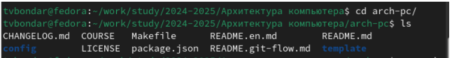

---
## Front matter
title: "Отчет по лабораторной работе №2"
subtitle: "дисциплина: Архитектура компьютера"
author: "Бондарь Татьяна Владимировна"

## Generic otions
lang: ru-RU
toc-title: "Содержание"

## Bibliography
bibliography: bib/cite.bib
csl: pandoc/csl/gost-r-7-0-5-2008-numeric.csl

## Pdf output format
toc: true # Table of contents
toc-depth: 2
lof: true # List of figures
lot: true # List of tables
fontsize: 12pt
linestretch: 1.5
papersize: a4
documentclass: scrreprt
## I18n polyglossia
polyglossia-lang:
  name: russian
  options:
	- spelling=modern
	- babelshorthands=true
polyglossia-otherlangs:
  name: english
## I18n babel
babel-lang: russian
babel-otherlangs: english
## Fonts
mainfont: IBM Plex Serif
romanfont: IBM Plex Serif
sansfont: IBM Plex Sans
monofont: IBM Plex Mono
mathfont: STIX Two Math
mainfontoptions: Ligatures=Common,Ligatures=TeX,Scale=0.94
romanfontoptions: Ligatures=Common,Ligatures=TeX,Scale=0.94
sansfontoptions: Ligatures=Common,Ligatures=TeX,Scale=MatchLowercase,Scale=0.94
monofontoptions: Scale=MatchLowercase,Scale=0.94,FakeStretch=0.9
mathfontoptions:
## Biblatex
biblatex: true
biblio-style: "gost-numeric"
biblatexoptions:
  - parentracker=true
  - backend=biber
  - hyperref=auto
  - language=auto
  - autolang=other*
  - citestyle=gost-numeric
## Pandoc-crossref LaTeX customization
figureTitle: "Рис."
tableTitle: "Таблица"
listingTitle: "Листинг"
lofTitle: "Список иллюстраций"
lotTitle: "Список таблиц"
lolTitle: "Листинги"
## Misc options
indent: true
header-includes:
  - \usepackage{indentfirst}
  - \usepackage{float} # keep figures where there are in the text
  - \floatplacement{figure}{H} # keep figures where there are in the text
---

# Цель работы

Целью работы является изучение идеологии и применения средств контроля версий, а так же приобретение практических навыков по работе с системой git.

# Задание

1. Создайте отчет по выполнению лабораторной работе в соответствующем каталоге рабочего пространства.
2. Скопируйте отчеты по выполнению предыдущих лабораторных работ в соответствующие каталоги созданного рабочего пространства.
3. Загрузите файлы на github.

# Теоретическое введение

# Выполнение лабораторной работы
## **3.1 Настройка github**
1. Создадим учётную запись на сайте https://github.com/ и заполним основные данные. Войдем в наш аккаунт на сайте.

{#fig:001 width=70%}
## **3.2 Базовая настройка git**
1. Cделаем предварительную конфигурацию git. Откроем терминал и введем следующие команды, указав имя и email владельца репозитория:
{#fig:002 width=70%}
2. Настроим utf-8 в выводе сообщений git.
{#fig:003 width=70%}
3. Зададим имя начальной ветки (будем называть её master):
{#fig:004 width=70%}
4. Настроим параметр autocrlf:
{#fig:005 width=70%}
5. Настроим параметр safecrlf:
{#fig:006 width=70%}
## **3.3 Создание SSH ключа**
1. Для последующей идентификации пользователя на сервере репозиториев сгенерируем пару ключей (приватный и открытый): 
{#fig:007 width=70%}
2. Далее необходимо загрузить сгенерированный открытый ключ. Для этого зайдем на сайт http: //github.org/ под своей учётной записью и перейдем в меню Setting . После этого выберем в боковом меню SSH консоли ключ в буфер обмена cat ~/.ssh/id_rsa.pub | xclip -sel clip вставляем ключ в появившееся на сайте поле и указываем для ключа имя (Title).
{#fig:008 width=70%}
## **3.4 Создание рабочего пространства и репозитория курса на основе шаблона.**
1. Откроем терминал и создадим каталог для предмета «Архитектура компьютера»: mkdir -p ~/work/study/2023-2024/"Архитектура компьютера". 
{#fig:009 width=70%}
## **3.5 Создание репозитория курса на основе шаблона**
1. Перейдем на страницу репозитория с шаблоном курса. Выберем Use this template. 
{#fig:010 width=70%}
2. В открывшемся окне зададим имя репозитория (Repository name) study_2023–2024_arhpc и создадим репозиторий (кнопка Create). 
{#fig:011 width=70%}
3. Откроем терминал и перейдем в каталог курса: 
{#fig:012 width=70%}
4. Клонируем созданный репозиторий: 
{#fig:013 width=70%}
## **3.6 Настройка каталога курса**
1. Перейдем в каталог курса.
{#fig:014 width=70%}
2. Удалим лишние файлы. 
{#fig:015 width=70%}
3. Создадим необходимые каталоги. 
{#fig:016 width=70%}
4. Отправим файлы на сервер. 
{#fig:017 width=70%}
{#fig:018 width=70%}
5. Проверим правильность создания иерархии рабочего пространства в локальном репозитории и на странице github.
{#fig:019 width=70%}
{#fig:020 width=70%}

# Задания для самостоятельной работы
{#fig:020 width=70%}
Мы перенесли файлы с отчетами к лабораторным работам №1 и №2 в рабочее пространство нашего компьютера. После чего используя команды git add, git commit -am, git push перенесли изменения в наше рабочее пространство Github.

# Выводы

Выполнив данную лабораторную работу, мы изучили идеологию и применение средств контроля версий, а так же приобрели практические навыки по работе с системой git.

