---
## Front matter
title: "Отчет по лабораторной работе №5"
subtitle: "дисциплина: Архитектура компьютера"
author: "Бондарь Татьяна Владимировна"

## Generic otions
lang: ru-RU
toc-title: "Содержание"

## Bibliography
bibliography: bib/cite.bib
csl: pandoc/csl/gost-r-7-0-5-2008-numeric.csl

## Pdf output format
toc: true # Table of contents
toc-depth: 2
lof: true # List of figures
lot: true # List of tables
fontsize: 12pt
linestretch: 1.5
papersize: a4
documentclass: scrreprt
## I18n polyglossia
polyglossia-lang:
  name: russian
  options:
	- spelling=modern
	- babelshorthands=true
polyglossia-otherlangs:
  name: english
## I18n babel
babel-lang: russian
babel-otherlangs: english
## Fonts
mainfont: IBM Plex Serif
romanfont: IBM Plex Serif
sansfont: IBM Plex Sans
monofont: IBM Plex Mono
mathfont: STIX Two Math
mainfontoptions: Ligatures=Common,Ligatures=TeX,Scale=0.94
romanfontoptions: Ligatures=Common,Ligatures=TeX,Scale=0.94
sansfontoptions: Ligatures=Common,Ligatures=TeX,Scale=MatchLowercase,Scale=0.94
monofontoptions: Scale=MatchLowercase,Scale=0.94,FakeStretch=0.9
mathfontoptions:
## Biblatex
biblatex: true
biblio-style: "gost-numeric"
biblatexoptions:
  - parentracker=true
  - backend=biber
  - hyperref=auto
  - language=auto
  - autolang=other*
  - citestyle=gost-numeric
## Pandoc-crossref LaTeX customization
figureTitle: "Рис."
tableTitle: "Таблица"
listingTitle: "Листинг"
lofTitle: "Список иллюстраций"
lotTitle: "Список таблиц"
lolTitle: "Листинги"
## Misc options
indent: true
header-includes:
  - \usepackage{indentfirst}
  - \usepackage{float} # keep figures where there are in the text
  - \floatplacement{figure}{H} # keep figures where there are in the text
---

# Цель работы

Целью работы является приобретение практических навыков работы в Midnight Commander и освоение инструкций
языка ассемблера mov и int.

# Задание

1. Создайте копию файла lab5-1.asm. Внесите изменения в программу (без использования внешнего файла in_out.asm), так чтобы она работала по следующему алгоритму:
    • вывести приглашение типа “Введите строку:”;
    • ввести строку с клавиатуры;
    • вывести введённую строку на экран.
2. Получите исполняемый файл и проверьте его работу. На приглашение ввести строку введите свою фамилию.
3. Создайте копию файла lab5-2.asm. Исправьте текст программы с использование подпрограмм из внешнего файла in_out.asm, так чтобы она работала по следующему алгоритму:
    • вывести приглашение типа “Введите строку:”;
    • ввести строку с клавиатуры;
    • вывести введённую строку на экран.
4. Создайте исполняемый файл и проверьте его работу.

# Теоретическое введение

# Выполнение лабораторной работы

1. Открываю Midnight commander и перехожу в каталог ~/work/arch-pc, созданный при выполнении лабораторной работы №4.(рис. -@fig:001)

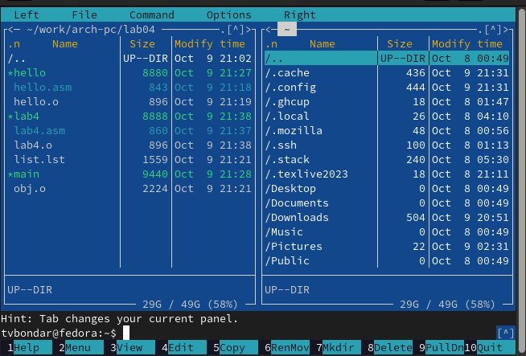{#fig:001 width=70%}

2. Создаю каталог lab05 и в нем файл lab5-1.asm.(рис. -@fig:002)

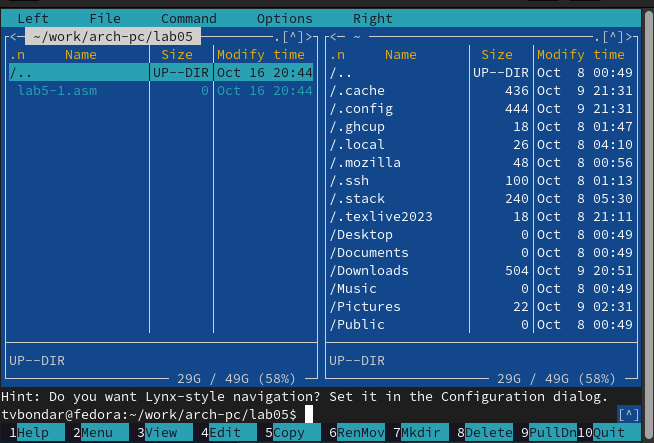{#fig:002 width=70%}

3. Открываю созданный файл с помощью встроенного редактора, начинаю вводить текст программы и сохраняю файл. (рис. -@fig:003, рис. -@fig:004)

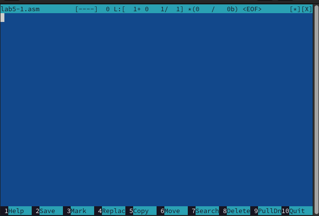{#fig:003 width=70%}

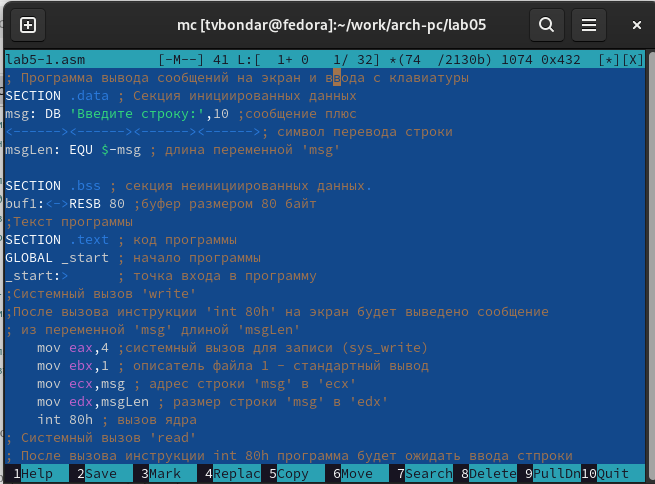{#fig:004 width=70%}

4. Открываю файл для просмотра. Убеждаюсь что он содержит текст программы. (рис. -@fig:005)

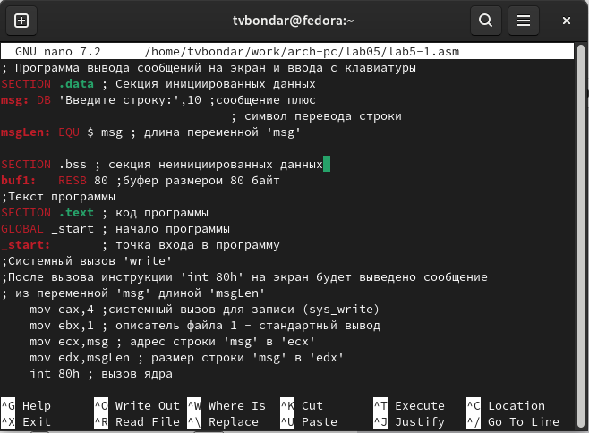{#fig:005 width=70%}

5. Транслирую текст программы в объектный файл, а затем в исполняемый. Запускаю исполняемый файл.(рис. -@fig:006, рис. -@fig:007)

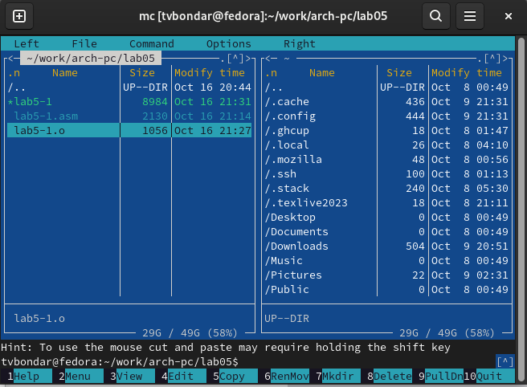{#fig:006 width=70%}

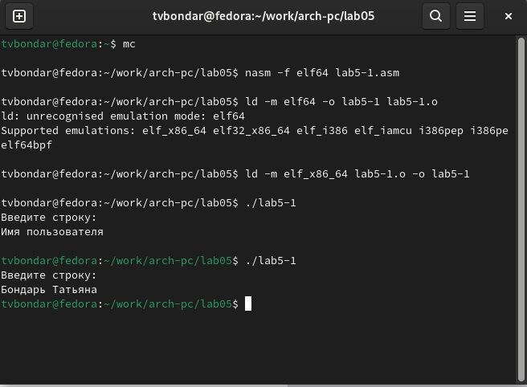{#fig:007 width=70%}

6. Скачиваю подключаемый файл in_out.asm со страницы курса в ТУИС. Копирую его в каталог ~/work/arch-pc/lab05.(рис. -@fig:008, рис. -@fig:009)

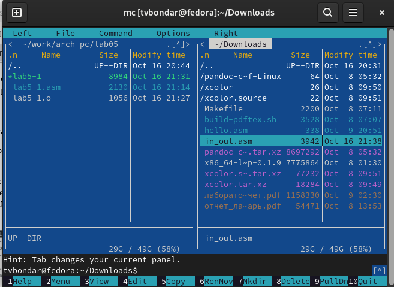{#fig:008 width=70%}

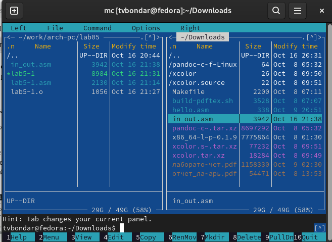{#fig:009 width=70%}

7. Создаю копию файла lab5-1.asm в том же каталоге и переименовываю ее в lab5-2.asm. (рис. -@fig:010)

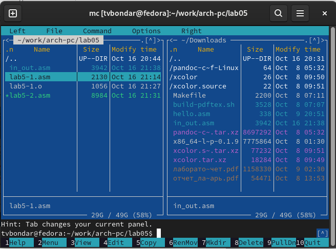{#fig:010 width=70%}

8. Исправляю текст программы в файле lab5-2.asm с использованием подпрограмм из внешнего файла in_out.asm. (рис. -@fig:011)

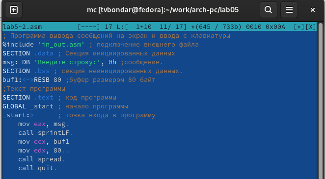{#fig:011 width=70%}

9. Компилирую исполняемый файл и проверяю его работу.(рис. -@fig:012)

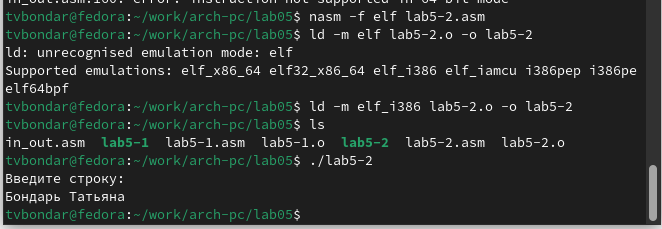{#fig:012 width=70%}

10. Заменяю в файле lab5-2.asm подпрограмму sprintLF на sprint. Проверяю работу программы. Ввод текста с клавиатуры теперь осуществляется на той же строке, где расположен текст, выводимый программой. (рис. -@fig:013)

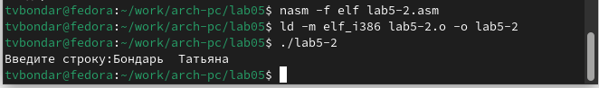{#fig:013 width=70%}

# Задания для самостоятельной работы

1. Создаю копию файла lab5-1.asm. Вношу изменения в программу (без использования внешнего файла in_out.asm), так чтобы она работала по следующему алгоритму:
    • вывести приглашение типа “Введите строку:”;
    • ввести строку с клавиатуры;
    • вывести введённую строку на экран.
    (рис. -@fig:014)

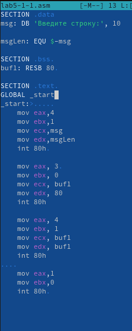{#fig:014 width=70%}

2. Запускаю исполняемый файл lab5-1-1. Программа работает корректно.(рис. -@fig:015)

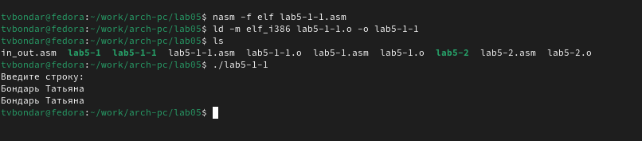{#fig:015 width=70%}

3. Создаю копию файла lab5-2.asm. Исправляю текст программы с использование подпрограмм из внешнего файла in_out.asm, так чтобы она работала по следующему алгоритму:
    • вывести приглашение типа “Введите строку:”;
    • ввести строку с клавиатуры;
    • вывести введённую строку на экран. 
    (рис. -@fig:016)
    
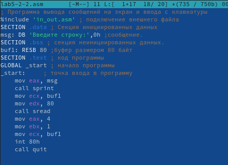{#fig:016 width=70%}

4. Запускаю исполняемый файл lab5-2-2. Программа работает корректно. (рис. -@fig:017)

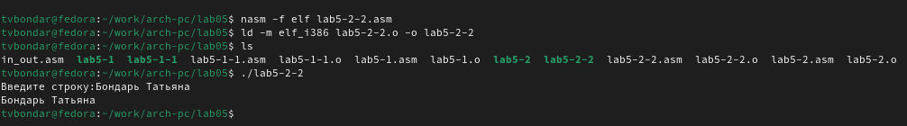{#fig:017 width=70%}

# Выводы

В результате выполнения лабораторной работы я приобрела практические навыки работы в Midnight Commander и освоила инструкции
языка ассемблера mov и int.

