---
## Front matter
title: "Отчет по лабораторной работе №6"
subtitle: "дисциплина: Архитектура компьютера"
author: "Бондарь Татьяна Владимировна"

## Generic otions
lang: ru-RU
toc-title: "Содержание"

## Bibliography
bibliography: bib/cite.bib
csl: pandoc/csl/gost-r-7-0-5-2008-numeric.csl

## Pdf output format
toc: true # Table of contents
toc-depth: 2
lof: true # List of figures
lot: true # List of tables
fontsize: 12pt
linestretch: 1.5
papersize: a4
documentclass: scrreprt
## I18n polyglossia
polyglossia-lang:
  name: russian
  options:
	- spelling=modern
	- babelshorthands=true
polyglossia-otherlangs:
  name: english
## I18n babel
babel-lang: russian
babel-otherlangs: english
## Fonts
mainfont: IBM Plex Serif
romanfont: IBM Plex Serif
sansfont: IBM Plex Sans
monofont: IBM Plex Mono
mathfont: STIX Two Math
mainfontoptions: Ligatures=Common,Ligatures=TeX,Scale=0.94
romanfontoptions: Ligatures=Common,Ligatures=TeX,Scale=0.94
sansfontoptions: Ligatures=Common,Ligatures=TeX,Scale=MatchLowercase,Scale=0.94
monofontoptions: Scale=MatchLowercase,Scale=0.94,FakeStretch=0.9
mathfontoptions:
## Biblatex
biblatex: true
biblio-style: "gost-numeric"
biblatexoptions:
  - parentracker=true
  - backend=biber
  - hyperref=auto
  - language=auto
  - autolang=other*
  - citestyle=gost-numeric
## Pandoc-crossref LaTeX customization
figureTitle: "Рис."
tableTitle: "Таблица"
listingTitle: "Листинг"
lofTitle: "Список иллюстраций"
lotTitle: "Список таблиц"
lolTitle: "Листинги"
## Misc options
indent: true
header-includes:
  - \usepackage{indentfirst}
  - \usepackage{float} # keep figures where there are in the text
  - \floatplacement{figure}{H} # keep figures where there are in the text
---

# Цель работы

Целью работы является освоение арифметических инструкций языка ассемблера NASM.

# Задание

1. Написать программу вычисления выражения y = f(x). Программа должна выводить выражение для вычисления, выводить запрос на ввод значения x, вычислять заданное выражение в зависимости от введенного x, выводить результат вычислений. Вид функции f(x) выбрать из таблицы 6.3 вариантов заданий в соответствии с номером полученным при выполнении лабораторной работы. Создайте исполняемый файл и проверьте его работу для значений x1 и x2 из 6.3. При выполнении задания преобразовывать (упрощать) выражения для f(x) нельзя. При выполнении деления в качестве результата можно использовать только целую часть от деления и не учитывать остаток (т.е. 5 ∶ 2 = 2).

# Теоретическое введение

# Выполнение лабораторной работы

1. Создаю каталог для программ лабораторной работы №6, перехожу в него и создаю файл lab6-1.asm.

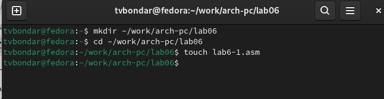{#fig:001 width=70%}

2. Ввожу в файл lab6-1.asm текст программы из листинга 6.1. Запускаю исполняемый файл.

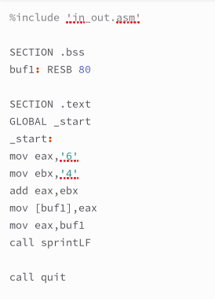{#fig:002 width=70%}

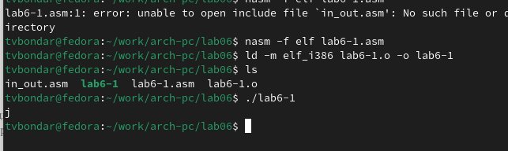{#fig:003 width=70%}

3. Изменим текст программы и вместо символов, запишем в регистры числа. Запустим исправленную программу. Теперь на экран вывелся символ с кодом 10. В соответствии с ASCII таблицей это символ перевода строк и он не отображается при выводе на экран.

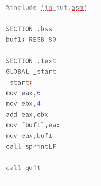{#fig:004 width=70%}

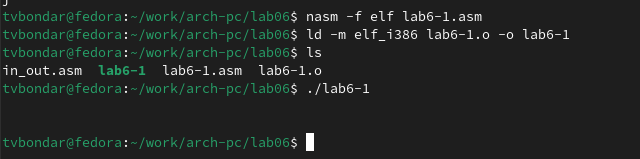{#fig:005 width=70%}

4. Создадим файл lab6-2.asm. Преобразуем текст программы из Листинга 6.1 с использованием подпрограмм из файла in_out.asm, которые преобразуют ASCII символы в числа и обратно.

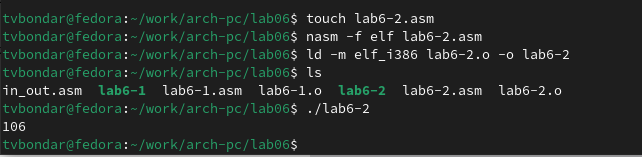{#fig:006 width=70%}

5. Аналогично предыдущему примеру исправим символы на числа и запустим программу. Теперь при запуске программы было получено само число 10, а не символ с соответсвующим кодом в системе ASCII. 

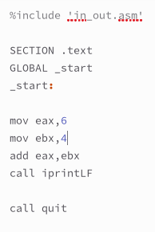{#fig:007 width=70%}

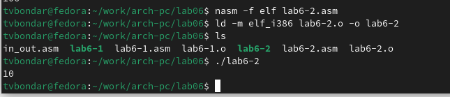{#fig:008 width=70%}

6. Далее заменяю функцию iprintLF на iprint. Запускаю исполняемый файл. Изменений нет.

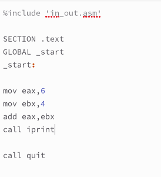{#fig:009 width=70%}

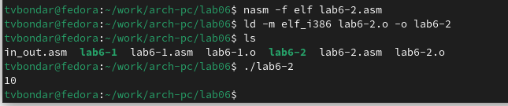{#fig:010 width=70%}

7. Создаю файл lab6-3.asm. Ввожу в него текст программы из листинга 6.3. Запускаю исполняемый файл.

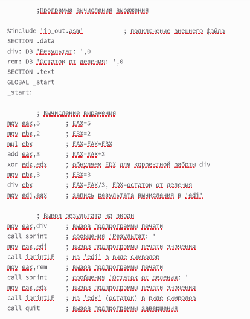{#fig:011 width=70%}

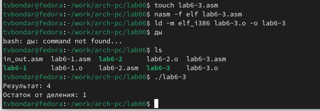{#fig:012 width=70%}

8. Изменяю текст программы для вычисления выражения f(x) = (4*6 + 2)/5.

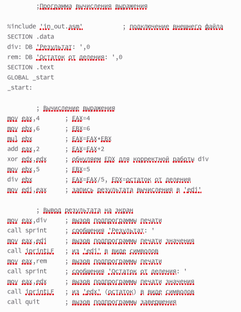{#fig:013 width=70%}

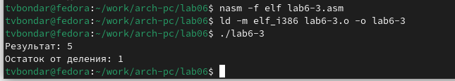{#fig:014 width=70%}

9. В качестве другого примера рассмотрим программу вычисления варианта задания по номеру студенческого билета, работающую по следующему алгоритму.
• вывести запрос на введение № студенческого билета
• вычислить номер варианта по формуле: (Sn mod 20) + 1, где Sn – номер студенческого билета (В данном случае a mod b – это остаток от деления a на b).
• вывести на экран номер варианта.

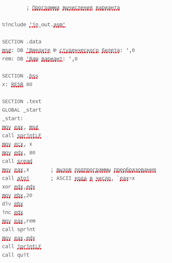{#fig:015 width=70%}

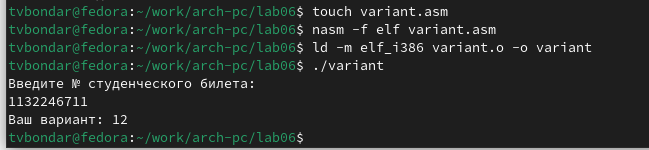{#fig:016 width=70%}

## Ответы на вопросы

1. Для вывода сообщения «Ваш вариант» предоставляются строки кода:
mov eax,rem
call sprintLF
2. Инструкция mov ecx, x используется, чтобы поставить адрес вводимой строки x в регистр ecx. mov edx, 80 - запись в регистр edx длины вводимой строки call sread - вызов подпрограммы из внешнего файла, вводы сообщений с клавиатуры
3. Вызов atoi используется для вызова подпрограмм из внешнего файла, который преобразует символы ascii-кода в имена чисел и записывает результат в регистр eax.
4. За вычисление варианта отвечают следующие предложения:
xor edx,edx     ; обнуление edx для корректной работы div
mov ebx,20      ; ebx = 20
div ebx         ; eax = eax/20, edx - остаток от деления
inc edx         ; edx = edx + 1
5. При выполнении инструкции остаток деления div ebx записывается в регистр edx.
6. Инструкция inc edx увеличивает значение регистра edx на 1
7. За вывод результатов на экране в листинге 6.4 отвечают строки:
mov eax,edx
call iprintLF

# Задания для самостоятельной работы

1. Создаю файл lab6-4.asm и ввожу в него текст программы для вычисления значения выражения (8*x-6)/2. Выражение было в варианте 12. Вычисляю значение выражения для заданных x. 

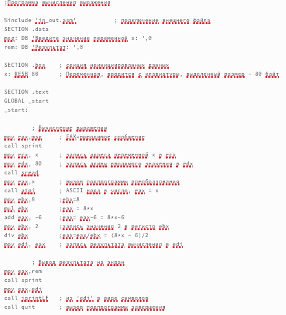{#fig:017 width=70%}

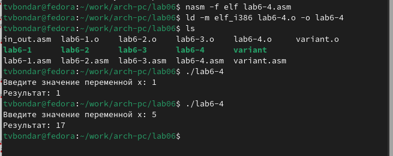{#fig:018 width=70%}

# Выводы

В результате выполнения лабораторной работы я освоила арифметические инструкции языка ассемблера NASM.

