---
## Front matter
title: "Отчет по лабораторной работе №9"
subtitle: "дисциплина: Архитектура компьютера"
author: "Бондарь Татьяна Владимировна"

## Generic otions
lang: ru-RU
toc-title: "Содержание"

## Bibliography
bibliography: bib/cite.bib
csl: pandoc/csl/gost-r-7-0-5-2008-numeric.csl

## Pdf output format
toc: true # Table of contents
toc-depth: 2
lof: true # List of figures
lot: true # List of tables
fontsize: 12pt
linestretch: 1.5
papersize: a4
documentclass: scrreprt
## I18n polyglossia
polyglossia-lang:
  name: russian
  options:
	- spelling=modern
	- babelshorthands=true
polyglossia-otherlangs:
  name: english
## I18n babel
babel-lang: russian
babel-otherlangs: english
## Fonts
mainfont: IBM Plex Serif
romanfont: IBM Plex Serif
sansfont: IBM Plex Sans
monofont: IBM Plex Mono
mathfont: STIX Two Math
mainfontoptions: Ligatures=Common,Ligatures=TeX,Scale=0.94
romanfontoptions: Ligatures=Common,Ligatures=TeX,Scale=0.94
sansfontoptions: Ligatures=Common,Ligatures=TeX,Scale=MatchLowercase,Scale=0.94
monofontoptions: Scale=MatchLowercase,Scale=0.94,FakeStretch=0.9
mathfontoptions:
## Biblatex
biblatex: true
biblio-style: "gost-numeric"
biblatexoptions:
  - parentracker=true
  - backend=biber
  - hyperref=auto
  - language=auto
  - autolang=other*
  - citestyle=gost-numeric
## Pandoc-crossref LaTeX customization
figureTitle: "Рис."
tableTitle: "Таблица"
listingTitle: "Листинг"
lofTitle: "Список иллюстраций"
lotTitle: "Список таблиц"
lolTitle: "Листинги"
## Misc options
indent: true
header-includes:
  - \usepackage{indentfirst}
  - \usepackage{float} # keep figures where there are in the text
  - \floatplacement{figure}{H} # keep figures where there are in the text
---

# *Цель работы*

Целью работы является приобретение навыков написания программ с использованием подпрограмм, а также знакомство с методами отладки при помощи GDB и его основными возможностями.

# *Задание*

1. Преобразуйте программу из лабораторной работы №8 (Задание №1 для самостоятельной работы), реализовав вычисление значения функции 𝑓(𝑥) как подпрограмму.
2. В листинге 9.3 приведена программа вычисления выражения (3 + 2) ∗ 4 + 5. При запуске данная программа дает неверный результат. Проверьте это. С помощью отладчика GDB, анализируя изменения значений регистров, определите ошибку и исправьте ее.

# *Теоретическое введение*

# *Выполнение лабораторной работы*

## *Реализация подпрограмм в NASM*

1. Создаю каталог для программ лабораторной работы №9, перехожу в него и создаю файл lab09-1.asm.

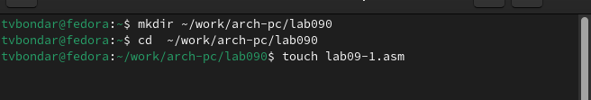{#fig:001 width=70%}

2.В качестве примера рассмотрим программу вычисления арифметического выражения 𝑓(𝑥) = 2𝑥 + 7 с помощью подпрограммы _calcul. В данном примере 𝑥 вводится с
клавиатуры, а само выражение вычисляется в подпрограмме. Ввожу в файл lab09-1.asm текст программы из листинга 9.1. Запускаю исполняемый файл.

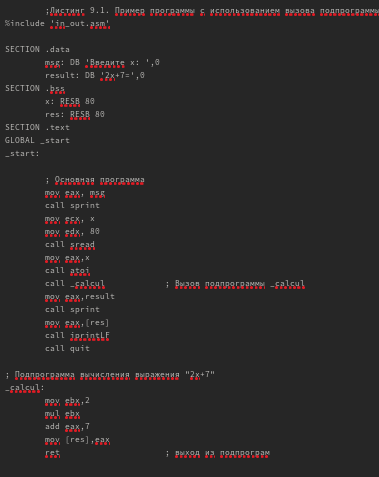{#fig:002 width=70%}

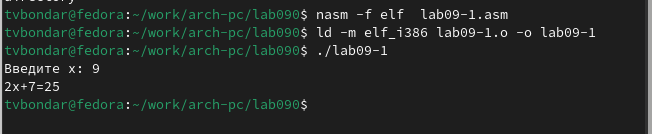{#fig:003 width=70%}

3. Изменим текст программы, добавив подпрограмму _subcalcul в подпрограмму _calcul, для вычисления выражения 𝑓(𝑔(𝑥)), где 𝑥 вводится с клавиатуры, 𝑓(𝑥) = 2𝑥 + 7, 𝑔(𝑥) =
3𝑥 − 1. Запустим исправленную программу. Число проходов цикла не соответствует значению, введенному с клавиатуры. 

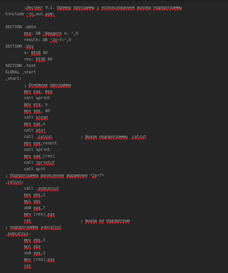{#fig:004 width=70%}

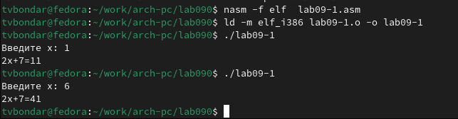{#fig:005 width=70%}

## *Отладка программ с помощью GDB*

4. Создаем файл lab09-2.asm. Вводим в него программу из листинга 9.2. Транслируем текст программы с ключом '-g'. Загружаем исполняемый файл в gdb.

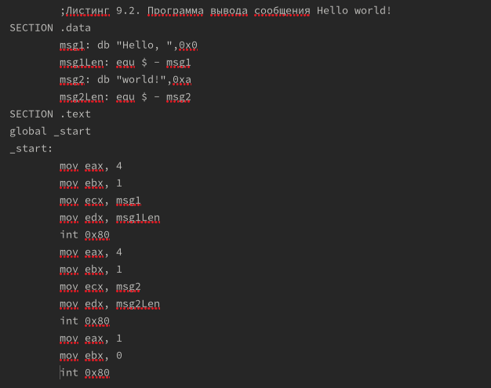{#fig:006 width=70%}

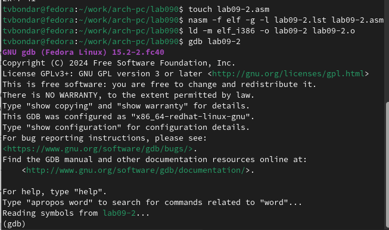{#fig:007 width=70%}

6. Проверим работу программы, запустив ее в оболочке отладчика. Ошибок не обнаружено.

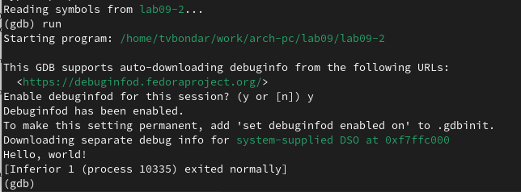{#fig:008 width=70%}

7. Для более подробного анализа программы установим брейкпоинт на метку _start, с которой начинается выполнение любой ассемблерной программы, и запустим её.

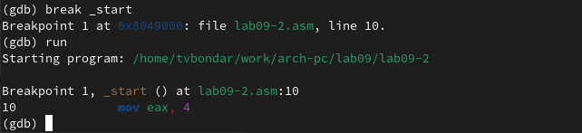{#fig:009 width=70%}

8. Посмотрим дисассимилированный код программы с помощью команды disassemble начиная с метки _start.

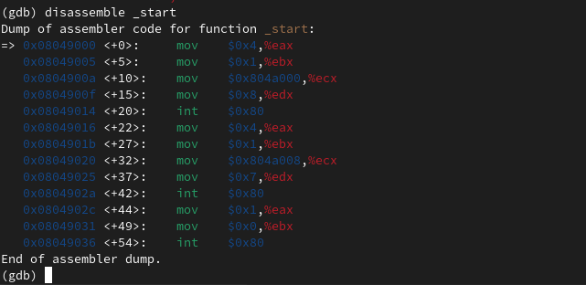{#fig:010 width=70%}

9. Переключимся на отображение команд с Intel’овским синтаксисом, введя команду set disassembly-flavor intel. Различия между синтаксисом ATT и Intel заключаются в порядке операндов(ATT - Операнд источника указан первым. Intel - Операнд назначения указан первым), их размере (ATT - pазмер операндов указывается явно с помощью суффиксов, непосредственные операнды предваряются символом $; Intel - Размер операндов неявно определяется контекстом, как ax, eax, непосредственные операнды пишутся напрямую), именах регистров(ATT - имена регистров предваряются символом %, Intel - имена регистров пишутся без префиксов).

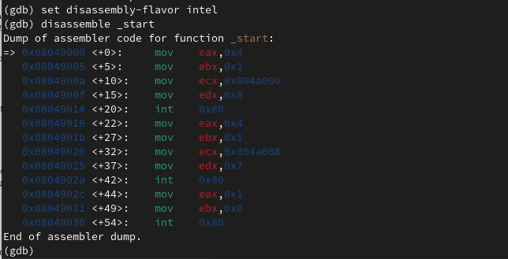{#fig:011 width=70%}

10. Включим режим псевдографики для более удобного анализа программы.

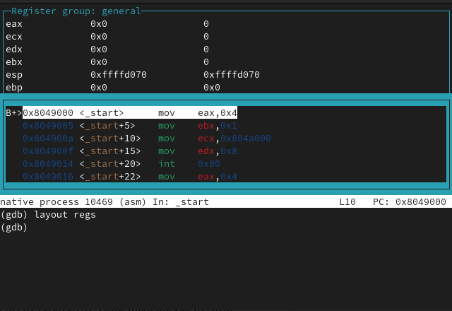{#fig:012 width=70%}

## *Добавление точек останова*

11. Проверим установку точки останова на метке '_start'. 

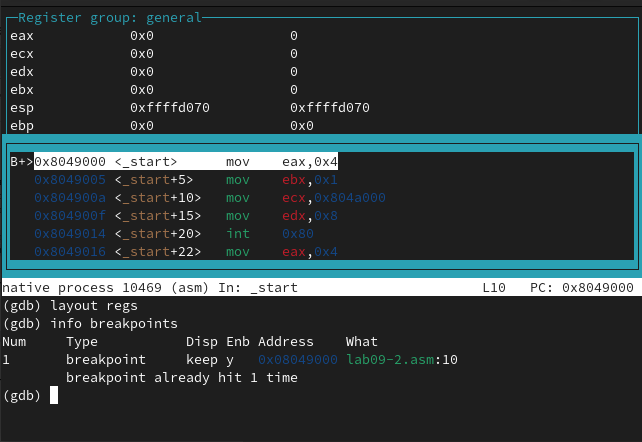{#fig:013 width=70%}

12. Установим еще одну точку останова по адресу инструкции. Определим адрес предпоследней инструкции (mov ebx,0x0) и установим точку останова.

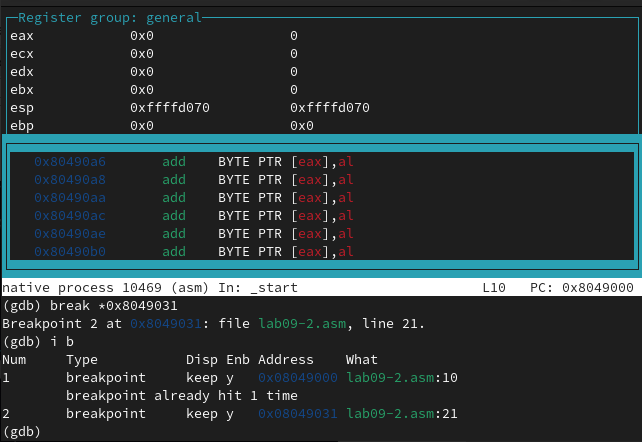{#fig:014 width=70%}

## *Работа с данными программы в GDB*

13. Выполним 5 инструкций с помощью команды stepi (или si) и проследим за изменением значений регистров. Изменяются значения регистров eax, ebx, ecx, edx.

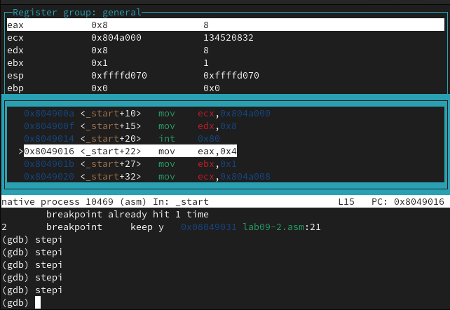{#fig:015 width=70%}

14. Посмотрим значение переменной msg1 по имени.

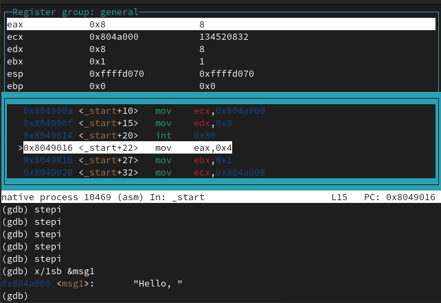{#fig:016 width=70%}

15. Просмотрим значение переменной msg2 по адресу.

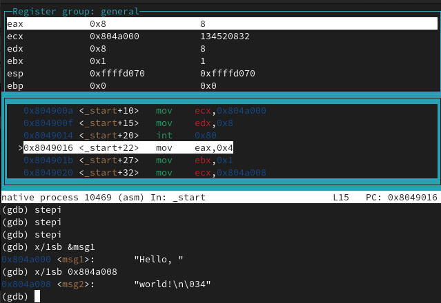{#fig:017 width=70%}

16. Изменим первый символ переменной msg1. Заменим любой символ во второй переменной msg2.

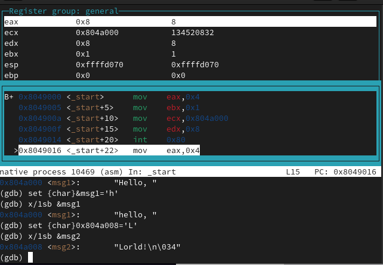{#fig:018 width=70%}

17. Выведем в различных форматах (в шестнадцатеричном формате, в двоичном формате и в символьном виде) значение регистра edx. С помощью команды set изменим значение регистра ebx. В первом случае программа выводит значение кодировки символа '2' в шестнадцатеричной системе, а во втором переводит цифру 2 в шестнадцатеричный вид. 

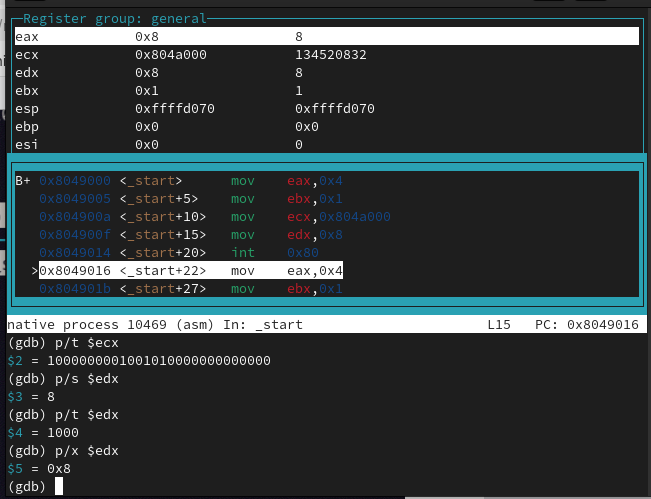{#fig:019 width=70%}

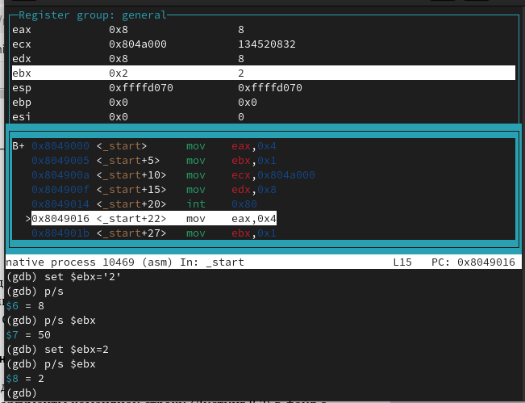{#fig:020 width=70%}

Завершаю выполнение программы и выхожу из отладчика.

## *Обработка аргументов командной строки в GDB*

18. Скопируем файл lab8-2.asm в файл с именем lab09-3.asm. Создадим исполняемый файл. Загрузим исполняемый файл в отладчик, указав аргументы.

{#fig:021 width=70%}

19. Для начала установим точку останова перед первой инструкцией в программе и запустим ее. Адрес вершины стека храниться в регистре esp и по этому адресу располагается число равное количеству аргументов командной строки (включая имя программы). Как видно, число аргументов равно 5 – это имя программы lab09-3 и непосредственно аргументы: аргумент1, аргумент, 2 и 'аргумент 3'.

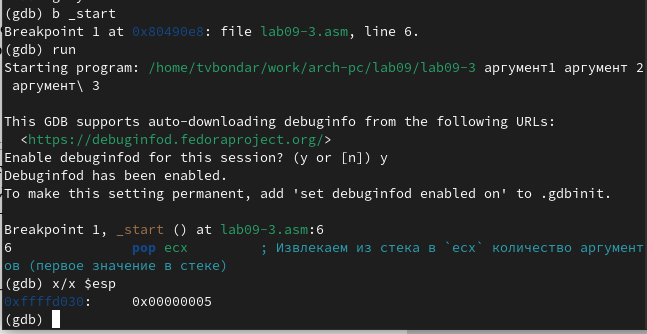{#fig:022 width=70%}

20. Посмотрим остальные позиции стека – по адесу [esp+4] располагается адрес в памяти где находится имя программы, по адесу [esp+8] храниться адрес первого аргумента, по адресу [esp+12] – второго и т.д. Шаг изменения адреса равен 4 байтам, потому что мы работаем с 32-битной системой (x86), а указатели (void **) в такой системе занимают 4 байта. Ошибка Cannot access memory at address 0x0 на $esp + 24 указывает на то, что закончились аргументы командной строки.

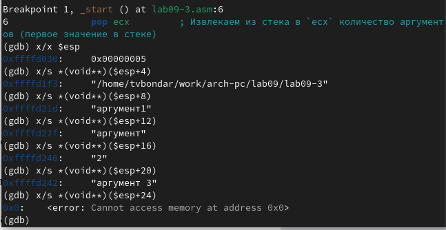{#fig:023 width=70%}

# *Задания для самостоятельной работы*

1. Преобразуем программу из лабораторной работы №8 (Задание №1 для самостоятельной работы), реализовав вычисление значения функции 𝑓(𝑥) как подпрограмму.

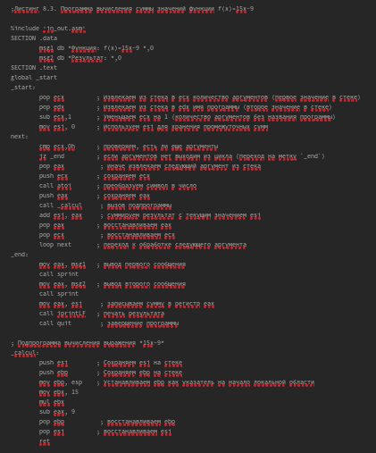{#fig:024 width=70%}

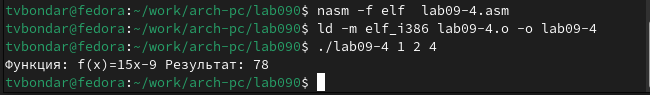{#fig:025 width=70%}

2. В листинге 9.3 приведена программа вычисления выражения (3 + 2) ∗ 4 + 5. При запуске данная программа дает неверный результат.  Ошибка в программе заключается в том, что инструкция mul ecx умножает значение в регистре eax на ecx, а результат записывает в eax. В исправленном варианте мы используем ebx для хранения промежуточного результата суммы, mul ecx умножает ebx  на ecx, результат сохраняется в eax. Затем к результату в eax добавляется 5. Финальный результат сохраняется в edi и выводится на экран.

Запускаем программу в режике отладичка и пошагово через si просматриваем изменение значений регистров через i r. При выполнении инструкции mul ecx можно заметить, что результат умножения записывается в регистр eax, но также меняет и edx. Значение регистра ebx не обновляется напрямую, поэтому программа неверно подсчитывает результат функции. Исправляем найденную ошибку, теперь программа верно считает значение функции.

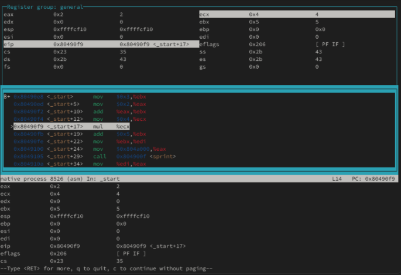{#fig:026 width=70%}

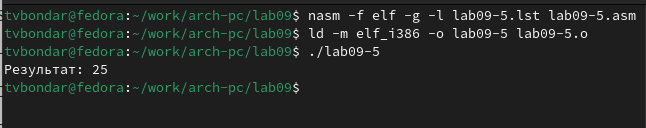{#fig:027 width=70%}

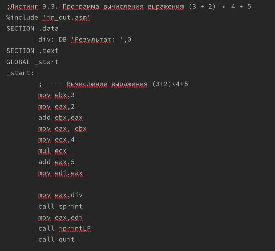{#fig:028 width=70%}

# *Выводы*

В результате выполнения лабораторной работы я приобрела навыки написания программ с использованием циклов и обработкой аргументов командной строки в NASM.
