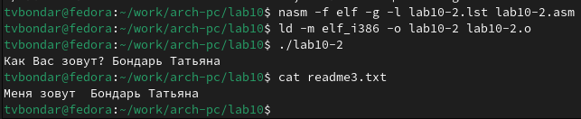

---
## Front matter
title: "Отчет по лабораторной работе №10"
subtitle: "дисциплина: Архитектура компьютера"
author: "Бондарь Татьяна Владимировна"

## Generic otions
lang: ru-RU
toc-title: "Содержание"

## Bibliography
bibliography: bib/cite.bib
csl: pandoc/csl/gost-r-7-0-5-2008-numeric.csl

## Pdf output format
toc: true # Table of contents
toc-depth: 2
lof: true # List of figures
lot: true # List of tables
fontsize: 12pt
linestretch: 1.5
papersize: a4
documentclass: scrreprt
## I18n polyglossia
polyglossia-lang:
  name: russian
  options:
	- spelling=modern
	- babelshorthands=true
polyglossia-otherlangs:
  name: english
## I18n babel
babel-lang: russian
babel-otherlangs: english
## Fonts
mainfont: IBM Plex Serif
romanfont: IBM Plex Serif
sansfont: IBM Plex Sans
monofont: IBM Plex Mono
mathfont: STIX Two Math
mainfontoptions: Ligatures=Common,Ligatures=TeX,Scale=0.94
romanfontoptions: Ligatures=Common,Ligatures=TeX,Scale=0.94
sansfontoptions: Ligatures=Common,Ligatures=TeX,Scale=MatchLowercase,Scale=0.94
monofontoptions: Scale=MatchLowercase,Scale=0.94,FakeStretch=0.9
mathfontoptions:
## Biblatex
biblatex: true
biblio-style: "gost-numeric"
biblatexoptions:
  - parentracker=true
  - backend=biber
  - hyperref=auto
  - language=auto
  - autolang=other*
  - citestyle=gost-numeric
## Pandoc-crossref LaTeX customization
figureTitle: "Рис."
tableTitle: "Таблица"
listingTitle: "Листинг"
lofTitle: "Список иллюстраций"
lotTitle: "Список таблиц"
lolTitle: "Листинги"
## Misc options
indent: true
header-includes:
  - \usepackage{indentfirst}
  - \usepackage{float} # keep figures where there are in the text
  - \floatplacement{figure}{H} # keep figures where there are in the text
---

# *Цель работы*

Целью работы является приобретение навыков написания программ для работы с файлами.

# *Задание*

1. Напишите программу работающую по следующему алгоритму:
    • Вывод приглашения “Как Вас зовут?”
    • ввести с клавиатуры свои фамилию и имя
    • создать файл с именем name.txt
    • записать в файл сообщение “Меня зовут”
    • дописать в файл строку введенную с клавиатуры
    • закрыть файл
Создать исполняемый файл и проверить его работу. Проверить наличие файла и его содержимое с помощью команд ls и cat.

# *Теоретическое введение*

# *Выполнение лабораторной работы*

1. Создадим каталог для программ лабораторной работы № 10, перейдем в него и
создадим файлы lab10-1.asm, readme-1.txt и readme-2.txt

{#fig:001 width=70%}

2.Введем в файл lab10-1.asm текст программы из листинга 10.1 (Программа записи в
файл сообщения). Создадим исполняемый файл и проверим его работу.

{#fig:002 width=70%}

{#fig:003 width=70%}

3. С помощью команды chmod изменим права доступа к исполняемому файлу lab10-1, запретив его выполнение. Попытаемся выполнить файл. Permission denied означает, что у нас нет прав на исполнение файла, так как мы запретили это для всех пользователей.

{#fig:004 width=70%}

4. С помощью команды chmod изменим права доступа к файлу lab10-1.asm с исходным текстом программы, добавив права на исполнение. Попытаемся выполнить его. Сам файл .asm исполнить невозможно, его нужно транслировать в исполняемый файл. У нас получилось вернуть права на исполнение файла lab10-1, теперь программа работает корректно.

{#fig:005 width=70%}

5. В соответствии с вариантом в таблице 10.4 предоставим права доступа к файлу readme-1.txt представленные в символьном виде, а для файла readme-2.txt – в двочном виде. Проверим правильность выполнения с помощью команды ls -l.

{#fig:006 width=70%}

# *Задания для самостоятельной работы*

1. Напишем программу работающую по следующему алгоритму:
    • Вывод приглашения “Как Вас зовут?”
    • ввести с клавиатуры свои фамилию и имя
    • создать файл с именем name.txt
    • записать в файл сообщение “Меня зовут”
    • дописать в файл строку введенную с клавиатуры
    • закрыть файл
Создаем исполняемый файл и проверить его работу. Проверим наличие файла и его
содержимое с помощью команд ls и cat. Программа работает корректно.

{#fig:007 width=70%}

{#fig:008 width=70%}

# *Выводы*

В результате выполнения лабораторной работы я приобрела навыки написания программ для работы с файлами.
